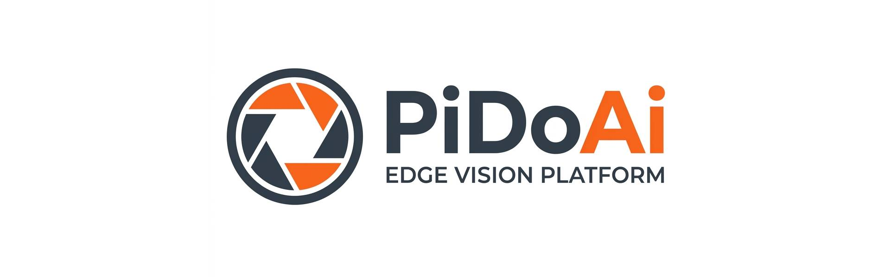
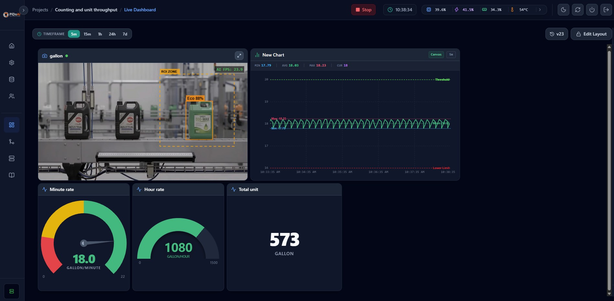
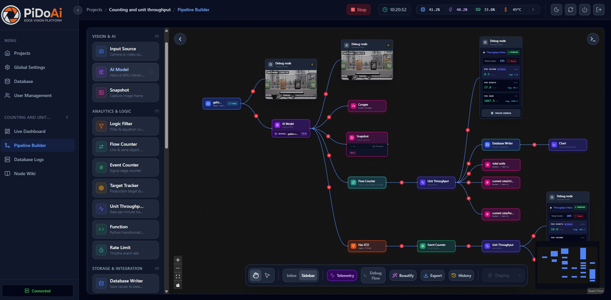
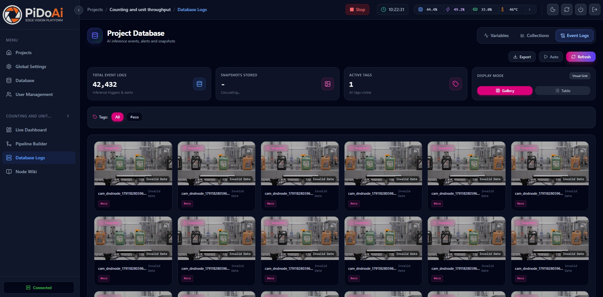
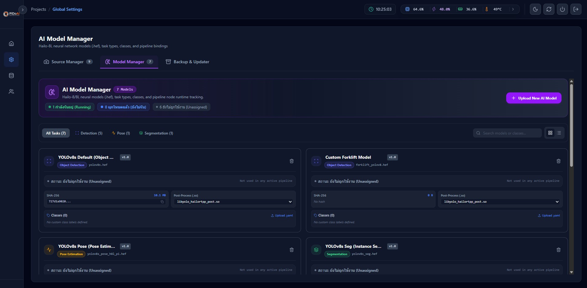
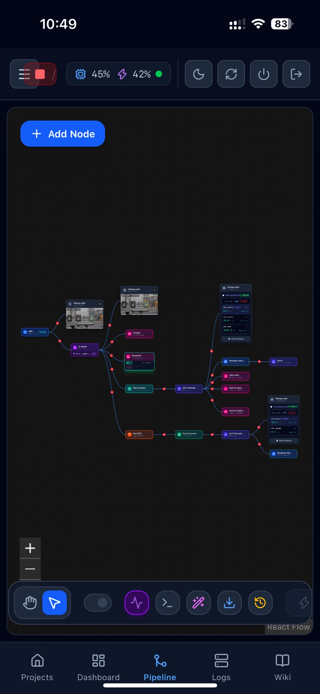
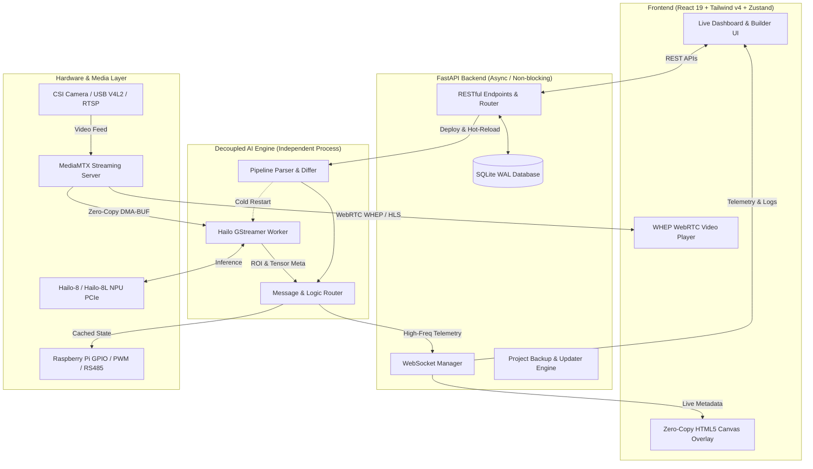

<!-- ========================================================================= -->
<!-- 📷 COVER PHOTO: TOP BANNER                                               -->
<!-- Recommended Size : 1920x600 or 1280x450 (Wide Banner ~16:5 or 16:9)       -->
<!-- Suggested Path   : docs/images/cover.jpg                                 -->
<!-- ========================================================================= -->
<div align="center">
  

  <br/><br/>

  <!-- 🏷️ REPOSITORY ICON / LOGO -->
  <!-- Suggested Path: docs/images/icon.png (Square / Icon 256x256 or 512x512) -->
  <a href="https://github.com/CytronTH/pido.ai">
    
  </a>

  <h1>PiDo.AI 🚀</h1>
  <h3>Industrial Edge AI Vision & Automation Platform for Raspberry Pi & Hailo-8/8L</h3>

  <p>
    <a href="LICENSE"></a>
    <a href="https://python.org"></a>
    <a href="https://fastapi.tiangolo.com"></a>
    <a href="https://react.dev"></a>
    <a href="https://tailwindcss.com"></a>
    <a href="https://hailo.ai"></a>
    <a href="https://www.raspberrypi.com"></a>
    
  </p>
</div>

**PiDo.AI** is an edge-first, no-code/low-code AI vision and industrial automation platform built specifically for edge computing devices (optimized for **Raspberry Pi 5** equipped with **Hailo-8 / Hailo-8L NPU accelerators**).

PiDo.AI bridges the gap between raw video streams, deep-learning models (YOLO, custom `.hef`), industrial hardware interfaces (GPIO, PWM, Relays, Tower Lights, RS485 Modbus), and modern web-based monitoring dashboards. With an intuitive visual drag-and-drop editor, operators and engineers can design, deploy, hot-reload, and supervise real-time AI computer vision pipelines on the factory floor without writing boilerplate code.

---

## 📸 Visual Showcase & Screenshots

<!-- ========================================================================= -->
<!-- 📷 IMAGE PLACEHOLDER: 01 - HERO / LIVE DASHBOARD OVERVIEW                 -->
<!-- Recommended Size : 1920x1080 (16:9)                                       -->
<!-- Suggested Path   : docs/images/hero-dashboard.png                         -->
<!-- Description      : Full view of Live Dashboard showing 24-col Grafana     -->
<!--                    grid, WebRTC AI video stream with bounding boxes,      -->
<!--                    Number/Metric widgets with Trend indicators, Gauges,   -->
<!--                    and System Resource monitoring.                        -->
<!-- ========================================================================= -->
### 📊 Live Interactive Dashboard
<div align="center">
  
  <p><em>Real-Time Dashboard: 24-column Grafana-style grid, Zero-Copy WebRTC video with AI bounding boxes & ROI overlay, and live industrial telemetry widgets.</em></p>
</div>

<br/>

<!-- ========================================================================= -->
<!-- 📷 IMAGE PLACEHOLDER: 02 - NO-CODE PIPELINE BUILDER                       -->
<!-- Recommended Size : 1920x1080 (16:9)                                       -->
<!-- Suggested Path   : docs/images/pipeline-builder.jpg                       -->
<!-- Description      : Visual Node Graph in PipelineBuilder showing input     -->
<!--                    camera, Hailo AI node, logic filters, and hardware I/O -->
<!-- ========================================================================= -->
### 🧩 No-Code Visual Pipeline Builder
<div align="center">
  
  <p><em>Visual Pipeline Builder: Connect video inputs, Hailo-8L neural inference, condition branching, and digital outputs with real-time telemetry badges.</em></p>
</div>

<br/>

<!-- ========================================================================= -->
<!-- 📷 IMAGE PLACEHOLDER: 03 - DATABASE LOGS & SNAPSHOT INSPECTOR             -->
<!-- Recommended Size : 1920x1080 (16:9)                                       -->
<!-- Suggested Path   : docs/images/database-logs-snapshots.jpg                -->
<!-- Description      : Database Event Logs view showing Gallery & Table views,-->
<!--                    inspection modal with snapshot image, tag filters,      -->
<!--                    and payload metadata inspection.                       -->
<!-- ========================================================================= -->
### 🗄️ Database Event Logs & Snapshot Visual Inspector
<div align="center">
  
  <p><em>Database Logs & Snapshot Inspector: Dual Gallery/Table views, event tag filtering (OK/NG/Defect), and full-resolution snapshot inspection with JSON payload trace.</em></p>
</div>

<br/>

### ⚙️ Platform Management & AI Tools
<table align="center" width="100%">
  <tr>
    <td width="50%" align="center">
      
      <p><small><strong>AI Model Registry:</strong> Collision-free storage, SHA-256 fingerprinting, versioning pills, and task post-process matching</small></p>
    </td>
    <td width="50%" align="center">
      <!-- 📷 IMAGE PLACEHOLDER: 05 - PLATFORM UPDATER & CHANNELS -->
      <!-- Suggested Path: docs/images/platform-updater.png / .jpg -->
      <div style="border: 2px dashed #4b5563; padding: 20px; border-radius: 8px; text-align: center;">
        <p>📷 <strong>Platform Updater (OTA & Air-Gapped)</strong></p>
        <p><em>(Replace with: <code>docs/images/platform-updater.jpg</code>)</em></p>
        <p><small>Release Channel Selector (Stable main / Dev dev), 1-click update, and offline .tar.gz upload</small></p>
      </div>
    </td>
  </tr>
</table>

<br/>

<!-- ========================================================================= -->
<!-- 📷 IMAGE PLACEHOLDER: 06 - MOBILE & TABLET RESPONSIVE UI                  -->
<!-- Recommended Size : 1200x800 or phone mockups                              -->
<!-- Suggested Path   : docs/images/mobile-responsive.jpg                      -->
<!-- Description      : Tablet and smartphone view with bottom navigation bar   -->
<!-- ========================================================================= -->
<div align="center">
  
  <p>📱 <em>Responsive Design: Mobile Bottom Navigation Bar & adaptive layouts for on-site factory floor inspection via tablets or phones.</em></p>
</div>

---

## ✨ Key Features & Capabilities

### 🧩 1. Visual Drag-and-Drop Pipeline Builder
- **No-Code Node Graph:** Designed with `@xyflow/react` for intuitive drag-and-drop workflow construction.
- **Hot-Reload Architecture:** Edit logic thresholds, polygon danger zones, or rate limits on the fly without stopping GStreamer or resetting the Hailo NPU.
- **Live Node Telemetry:** Real-time throughput indicators, status badges, and execution timing right on the canvas.
- **Rich Node Catalog (30+ Nodes):**
  - **Input Nodes:** Raspberry Pi Camera Module (CSI / libcamera / IMX708), USB Webcams (V4L2), RTSP IP Cameras, and Test Video files with live thumbnail previews.
  - **AI Inference Nodes:** Hailo-8/8L NPU acceleration with custom HEF models, YOLOv8 object detection, and dynamic class filters.
  - **Warehouse Safety Monitor (`ForkliftZoneNode`):** Polygon Danger Zone Editor, Ground-Contact Footprint Anchor (`cx, ymax`) to eliminate false alarms from mast heights at 45° camera angles, and Co-Presence collision alerts (`person` + `forklift`).
  - **Smart Inventory Monitor (`ShelfSlotMonitorNode`):** Slot-by-slot empty shelf detection with Person Occlusion Suppression (temporarily freezes checks when humans reach into shelves).
  - **Tracking & Counting:** `TargetTrackerNode`, `CounterNode`, `FlowCounterNode`, and `UnitThroughputNode` (Units/Min, Units/Hour, Cycle time, and pause timeout handling).
  - **Logic & Flow Control:** `LogicNode` (comparisons `>`, `<`, `==`), `RateLimitNode`, and `FunctionNode` (custom Python script execution).
  - **Industrial Hardware I/O:** `DigitalInputNode`, `DigitalOutputNode`, `LEDNode`, `BuzzerNode` (PWM acoustic warnings), and `RS485Node` (Modbus RTU / Serial).
  - **Data & Storage:** `DatabaseWriterNode`, `CollectionWriterNode`, and `SnapshotNode` (event-triggered image captures).
  - **Live Debuggers:** `DebugNode` and `DebugOutputNode` (real-time WebSocket terminal inspection).

---

### 📊 2. High-Performance Live Dashboard
- **24-Column Grafana-Style Fine Grid:** Highly configurable grid (24 columns, 30px row height, 8px gutters) with subtle alignment guides in edit mode.
- **Flexible Layout Modes:** Instant toggle between **Auto-Arrange** (Vertical compacting) and **Free Placement** (place widgets anywhere).
- **Dashboard Version History & Rollback:**
  - Create versioned snapshots (`v1`, `v2`, etc.) with mandatory change notes.
  - Interactive version timeline, diff inspection, and 1-click restore (without touching pipeline logic).
  - Unsaved change tracking, dirty badges, and accidental navigation warnings (`beforeunload`).
- **20+ Specialized Widgets:**
  - 📹 **Video Stream Widget:** WebRTC WHEP / HLS streaming with a Zero-Copy HTML5 Canvas overlay for real-time bounding boxes, ROI zones, and AI FPS (avoids 30 FPS React re-renders). Auto-detects dangling data paths.
  - 🔢 **Number / Metric Widget:** Large numeric readouts with comma formatting, inline/below unit suffixes, Compact Notation (`1.5K`, `2.3M`), Real-time Trend / Delta indicators (▲/▼ with % or diff value), and Neon Card Glow on alerts.
  - ⏱️ **Unified Gauge Widget:** 4 selectable visual styles: *Modern Half-Circle*, *Horseshoe with Needle*, *Radial Donut*, and *Capacity Bar* (horizontal/vertical tube) with visual color zone editor.
  - 📈 **Chart & Analytics Widget:** Time-series charts with human-readable timestamps ("today", "12s ago"), live settings preview, and 6 display templates (*Live Trend*, *Step/State*, *Volume Area*, *Count Bars*, *Threshold Monitor*, *Multi-Series*).
  - 🚦 **Industrial Status Widgets:** Traffic Light (Red/Yellow/Green), Target Tracker, Action Buttons (direct manual triggers), Snapshots Gallery, and System Resources.

---

### 🤖 3. AI Model Registry & PiDo.AI Model Studio
- **Collision-Proof Storage:** Automatically saves models with unique internal IDs (`<model_id>_<clean_filename>`), preventing generic `best.hef` files from overwriting each other.
- **Cryptographic Fingerprinting:** Full SHA-256 verification and file size tracking with 1-click copy for traceability.
- **Smart Task Mapping:** Auto-matches task types to Hailo post-processing shared libraries (e.g., `libyolo_hailortpp_post.so`) and extracts class names directly from `metadata.yaml`.
- **Companion PC Software: PiDo.AI Model Studio:**
  - Dedicated desktop app ([pido.ai-model-studio](https://github.com/CytronTH/pido.ai-model-studio)) for compiling ONNX models to Hailo `.hef`.
  - One-click network deployment directly to your Raspberry Pi.

---

### 🔄 4. Platform Updater (OTA & Offline Air-Gapped)
- **Release Channels:** Seamlessly toggle between 🛡️ **Stable (`main`)** and ⚡ **Development (`dev`)** branches directly in the Web UI.
- **One-Click Online Update:** Checks remote GitHub commits, pulls latest code, runs database migrations, and recompiles frontend bundles (`npm run build`).
- **Offline Air-Gapped Factory Deployment:** Upload `.tar.gz` packages for plants without internet access. Includes `create_update_package.sh` for easy package preparation.
- **Safe Detached Runner (`updater.sh`):** Runs update scripts in an isolated process to prevent service aborts during systemctl restarts.
- **Auto-Backup & Recovery:** Automatically backs up databases and environment configs to `/home/pi/pido-ai-backups/` (keeps latest 5 versions).

---

### 🗄️ 5. Database Event Logging & Snapshot Visual Inspector
- **Dual Visual Modes:** Switch between **Gallery View** (visual grid of image thumbnails with camera ID and timestamp badges) and **Table View** (structured tabular log with expandable metadata).
- **Inspection Lightbox:** Full-resolution modal viewer with quick download, copy JSON payload, and full trace of detection classes, confidence scores, and bounding coordinates.
- **Smart Tag Filtering:** Filter logs by trigger tags (e.g., `OK`, `NG`, `Defect`, `Forklift Critical`) and specific camera sources.
- **Real-Time Telemetry Sync:** Auto-refresh toggle and live polling of database event stream.

---

### 💾 6. Project Backup, Migration & Storage Maintenance
- **Full Deployment Bundles (`.pidoproj`):** Export complete projects including pipeline graphs, dashboard layouts, database records, and compiled `.hef` AI models for instant cloning to new boards.
- **Zip Slip Safe & Atomic Import:** Pre-inspection dry-run modal with dependency verification and collision handling.
- **Storage Auto-Pruning:** SQLite WAL mode with batch purging (500 records/batch) and automatic disk cleanup of expired snapshot images based on retention policies (7, 14, 30, 60 days).

---

### 🎨 7. Modern Design System & Mobile Readiness
- **Semantic Design Tokens:** Built on Tailwind CSS v4 with custom variables (`canvas`, `surface-*`, `line-*`, `fg-*`, `primary`, `status`, `chart-*`).
- **True Dark / Light / System Mode:** Smooth theme switching with zero flash-of-unstyled-content and cross-tab synchronization.
- **Mobile Bottom Navigation:** Tailored for quick access to Projects, Dashboard, Pipelines, Logs, and Settings on smartphones and tablets.

---

## 🏗️ System Architecture



---

## 🛠️ Technology Stack

| Layer | Technologies |
| :--- | :--- |
| **Frontend Framework** | React 19, Vite, React Router v6 |
| **Styling & Icons** | Tailwind CSS v4 (Semantic Tokens), Lucide React |
| **State & Flow** | Zustand, React Flow (`@xyflow/react`) |
| **Dashboard & Charts** | React Grid Layout (24-col), Recharts, HTML5 Canvas |
| **Backend Core** | Python 3.11+, FastAPI, Uvicorn, Asyncio, Pydantic |
| **AI Inference** | HailoRT 4.x, GStreamer 1.22+, DMA-BUF Zero-Copy, OpenCV |
| **Video Distribution** | MediaMTX (WebRTC WHEP, RTSP, HLS) |
| **Database & Cache** | SQLite (WAL mode, batch pruning), JSON Entity Store |
| **Industrial I/O** | `RPi.GPIO`, Serial / RS485 Modbus, Hardware PWM |
| **Packaging & OTA** | Shell automation (`updater.sh`), Tarball Offline Bundles |

---

## 📂 Project Structure

```text
pido-ai/
├── backend/                       # Python FastAPI & Edge AI Services
│   ├── ai_engine/                 # Hailo worker, GStreamer pipelines, Message router
│   │   ├── hailo_worker.py        # GStreamer + HailoRT inference engine
│   │   ├── message_router.py      # Node state management & handle routing
│   │   ├── pipeline_parser.py     # Graph-to-pipeline translator
│   │   ├── forklift_zone_monitor.py # Warehouse forklift safety monitor
│   │   └── shelf_slot_monitor.py  # Shelf slot detection with occlusion logic
│   ├── db/                        # Database models, migrations, and entities
│   │   ├── database.py            # SQLite connection with WAL & batch purge
│   │   └── models.py              # SQLAlchemy schemas & dashboard versions
│   ├── hardware/                  # GPIO, PWM, and RS485 communication handlers
│   ├── mediamtx/                  # MediaMTX binaries and configuration
│   ├── models/                    # Hailo HEF model files (.hef)
│   ├── scripts/                   # Platform update scripts (updater.sh, package creator)
│   ├── web_server/                # FastAPI application, routers & WebSockets
│   └── requirements.txt           # Python package requirements
├── frontend/                      # React 19 Single Page Application
│   ├── src/
│   │   ├── components/
│   │   │   ├── DashboardWidgets/  # 20+ Live Dashboard widgets
│   │   │   ├── DashboardVersions/ # Version timeline, save modal & rollback
│   │   │   ├── PipelineBuilder/   # Node editor, 30+ custom nodes & modals
│   │   │   ├── Settings/          # Model registry, camera sources, updater
│   │   │   └── Home/              # Project management & backup modal
│   │   ├── store/                 # Zustand global stores (theme, pipeline)
│   │   └── index.css              # Semantic CSS tokens & Tailwind v4
│   └── package.json               # Node.js dependencies & scripts
├── install.sh                     # Automated single-command installation
├── start-prod.sh                  # Production single-port launcher (port 8000)
├── start.sh                       # Developer launcher (Vite hot-reload + API)
├── DEVLOG.md                      # Detailed chronological engineering log
└── README.md                      # Project documentation
```

---

## 🚀 Getting Started

### Prerequisites
- **Hardware:** Raspberry Pi 5 (or Pi 4) with Raspberry Pi OS (Bookworm 64-bit recommended).
- **AI Accelerator:** Hailo-8 or Hailo-8L M.2 AI Acceleration Module.
- **HailoRT:** Ensure Hailo drivers and PCIe drivers are installed (`lspci | grep -i hailo`).
- **Dependencies:** Node.js 18+ and Python 3.11+.

---

### Installation

#### ⚡ 1. One-Line Quick Install (Recommended)
Installs all system packages (GStreamer, Node.js, Python dependencies), builds the frontend, and configures auto-start services:

```bash
curl -sSL https://raw.githubusercontent.com/CytronTH/pido.ai/main/install.sh | bash
```

---

#### 🛠️ 2. Manual Installation from Source

1. **Clone the repository:**
   ```bash
   git clone https://github.com/CytronTH/pido.ai.git
   cd pido.ai
   ```

2. **Run the local installer:**
   ```bash
   chmod +x install.sh
   ./install.sh
   ```

*(Alternatively, manual build: `cd frontend && npm install && npm run build` and `cd ../backend && python3 -m venv --system-site-packages venv && ./venv/bin/pip install -r requirements.txt`)*

---

### Running the Platform

#### 🚀 Production Mode (Recommended for Raspberry Pi)
Runs the unified single-port server on port `8000`, serving both the pre-built React frontend and FastAPI backend with minimal RAM consumption:

```bash
chmod +x start-prod.sh
./start-prod.sh
```

- **Web Dashboard:** `http://localhost:8000` (or `http://<raspberry-pi-ip>:8000`)
- **MediaMTX Video Ports:** RTSP `8554` | WebRTC WHEP `8889` | HLS `8888`

#### 🛠️ Development Mode (For Developers)
Runs Vite with hot-module reloading alongside the FastAPI backend:

```bash
chmod +x start.sh
./start.sh
```

- **Frontend (Hot Reload):** `http://localhost:5173`
- **Backend API:** `http://localhost:8000`

---

## ⚙️ Configuration (`.env`)

Create or modify `backend/.env` to configure your environment:

```ini
# Server Configuration
HOST=0.0.0.0
PORT=8000
ENVIRONMENT=production

# Media Server
MEDIAMTX_API_URL=http://localhost:9997
MEDIAMTX_RTSP_PORT=8554
MEDIAMTX_WEBRTC_PORT=8889

# AI & Hardware
HAILO_DEVICE_ID=0000:01:00.0
DEFAULT_CONFIDENCE_THRESHOLD=0.5
STORAGE_RETENTION_DAYS=30
```

---

## 🔧 Typical Workflow Guide

1. **Create or Import a Project:**
   - Create a new project on the Home screen or import an existing `.pidoproj` package.
2. **Register AI Models:**
   - Navigate to **Settings > AI Models** to upload `.hef` files (or deploy directly from **PiDo.AI Model Studio** on your PC).
3. **Build your Pipeline:**
   - Open **Pipeline Builder** and drag an **Input Node** (e.g., Camera or RTSP).
   - Connect it to an **AI Node** and select your model.
   - Attach smart safety nodes (e.g., `ForkliftZoneNode` or `ShelfSlotMonitorNode`) and configure detection zones.
   - Route outputs to **Hardware Nodes** (e.g., LED / Buzzer) and **Dashboard Exporters**.
4. **Deploy:**
   - Click **Save & Deploy**. Telemetry badges will light up green across the graph.
5. **Design your Live Dashboard:**
   - Switch to **Live Dashboard**, enter **Edit Mode**, and add widgets (Video, Gauges, Number metrics, Charts).
   - Click **Save Version** and enter a change note (e.g., *"Initial production layout with safety alerts"*).
6. **Monitor & Supervise:**
   - View live AI detections, track cycle counts, and monitor hardware triggers in real-time.

---

## 📝 Development Status & Roadmap

### ✅ Completed & Production-Ready
- [x] Node-based visual pipeline graph with hot-reload capabilities
- [x] Hailo-8 / Hailo-8L NPU acceleration with zero-copy GStreamer pipeline
- [x] MediaMTX WebRTC (WHEP), RTSP, and HLS low-latency streaming
- [x] 24-column Grafana-style Live Dashboard with Auto-arrange and Free Placement
- [x] Dashboard Version History with mandatory change notes & 1-click restore
- [x] 20+ specialized widgets (Canvas video overlay, Trend number, Unified gauge, Chart templates)
- [x] Warehouse Forklift Safety Monitor with 45° perspective Ground-Contact Footprint Anchor
- [x] Shelf Slot Monitor with Person Occlusion Suppression
- [x] Collision-proof AI Model Registry with SHA-256 fingerprinting & task selector
- [x] Full Project Backup & Migration (`.pidoproj` bundles & snapshots)
- [x] Platform Updater with Online OTA & Offline Air-Gapped packages and Release Channel selection
- [x] Storage auto-pruning with chunked SQLite purge and synchronized snapshot cleanup
- [x] Semantic Design Tokens (Dark / Light / System Mode) & Mobile Navigation Bar

### 🚧 In Progress
- [ ] Standalone Docker container generation for deployed pipelines
- [ ] Modbus TCP client/server integration for industrial PLCs
- [ ] Multi-camera parallel pipeline orchestration

### 🛡️ Air-Gapped & Enterprise Roadmap
- [ ] Zero-touch USB auto-deployment
- [ ] Multi-tier Role-Based Access Control (RBAC: Admin, Operator, Viewer)
- [ ] Audit logging for compliance and factory quality control
- [ ] Built-in Wi-Fi Access Point (Hotspot mode) for direct technician connections

---

## 📜 License

This project is licensed under the MIT License - see the [LICENSE](LICENSE) file for details.

---

<div align="center">
  <sub>Developed by <a href="https://github.com/CytronTH">CytronTH</a>. Built for Edge AI Vision & Smart Manufacturing.</sub>
</div>
